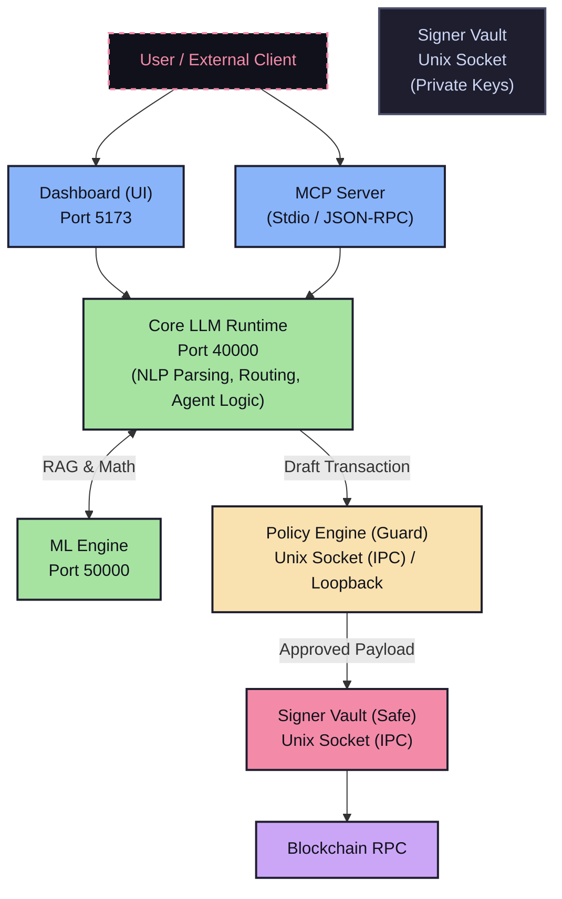

# Nyxora Agent 
**Your Personal Web3 Assistant.**


[](#)
[](https://debank.com/profile/0xe5c21f46993c67cfe04fcf1579486d390be7b535)

[](#)
[](https://opensource.org/licenses/MIT)
[](#️-advanced-security-threat-model)
[](#️-advanced-security-threat-model)
[](#️-advanced-security-threat-model)
[](https://makeapullrequest.com)

Nyxora is a **secure, non-custodial runtime infrastructure for autonomous onchain agents** built with a robust Monorepo architecture (Node.js & React). Designed for autonomous workflows with a premium Utility-Centric dark-themed UI and strict client-side key isolation. 

**Nyxora now natively supports the Model Context Protocol (MCP)**. You can transform your external AI agents (like Claude Desktop and Cursor) into secure Web3 actors that execute swaps and fetch balances using Nyxora's secure signer vault. [View the MCP Integration Guide](https://perasyudha.github.io/Nyxora/mcp/)

It operates under a **Zero-Trust, Defense-in-Depth Cryptographically Bound Human-in-the-Loop** execution model, ensuring that Remote AIs (LLMs) never have unilateral access to your funds.

<br/>

## ⚡ Supported Ecosystem & Integrations

**🧠 The Brain (AI / LLM Providers)**
<p align="center">
  <a href="https://openai.com/"></a>
  <a href="https://cloud.google.com/ai/gemini?hl=id"></a>
  <a href="https://claude.com/platform/api"></a>
  <a href="https://console.groq.com/keys"></a>
  <a href="https://mistral.ai/"></a>
  <a href="https://x.ai/"></a>
  <a href="https://www.deepseek.com/en/"></a>
  <a href="https://openrouter.ai/"></a>
  <a href="https://ollama.com/"></a>
</p>

**⛓️ The Muscles (Web3 & DeFi Ecosystem)**
<p align="center">
  <a href="https://www.base.org/"></a>
  <a href="https://arbitrum.io/"></a>
  <a href="https://optimism.io/"></a>
  <a href="https://ethereum.org/"></a>
  <a href="https://www.bnbchain.org/en/bnb-smart-chain"></a>
  <a href="https://1inch.com/id"></a>
  <a href="https://0x.org/"></a>
  <a href="https://li.fi/"></a>
  <a href="https://kyberswap.com/"></a>
  <a href="https://openocean.finance/"></a>
  <a href="https://relay.link/"></a>
  <a href="https://www.coingecko.com/"></a>
  <a href="https://coinmarketcap.com/"></a>
  <a href="https://dexscreener.com/"></a>
  <a href="https://gopluslabs.io/en"></a>
</p>

**💻 Core Technologies**
<p align="center">
  <a href="https://nodejs.org/"></a>
  <a href="https://react.dev/"></a>
  <a href="https://www.typescriptlang.org/"></a>
  <a href="https://viem.sh/"></a>
  <a href="https://www.python.org/"></a>
  <a href="https://fastapi.tiangolo.com/"></a>
  <a href="https://www.langchain.com/"></a>
</p>

<br/>

---

## 🔥 Key Features

### Advanced Security Architecture
*   **🛡️ On-Chain AI Kill-Switch**: Nyxora is governed by a Base Smart Contract (`NyxoraAgentRegistry`). Users have absolute cryptographic power to instantly paralyze the AI's on-chain execution if compromised, solving the Web3 AI safety dilemma. [Read more about our Base Architecture](https://perasyudha.github.io/Nyxora/smart-contract)
*   **6-Tier Hybrid Architecture**: Nyxora is split into isolated microservices: **Dashboard** (Port 5173), **MCP Server** (Port 3001), **Core LLM** (Port 40000), **ML Engine** (Python Sidecar on Port 50000), **Policy Engine** (Unix Socket), and **Signer Vault** (Unix Socket).
*   **DeFi & Market Configuration BYOK & UI Masking**: All aggregator, provider, and oracle API keys are strictly isolated via a Bring Your Own Keys (BYOK) architecture into heavily guarded `~/.nyxora/defi_keys.yaml` and `~/.nyxora/market_keys.yaml` files. The local web Dashboard masks these injected secrets using `***********` and `IS_SET` censorship, completely neutralizing malicious browser extensions from exfiltrating your keys.
*   **Approval Replay Protection (Nonce Guard)**: Transactions requested by the AI are drafted as hashes and signed with a randomized 16-byte Nonce. The `/api/transactions/:id/approve` endpoint strictly enforces Nonce matching to completely eliminate double-spending and Replay Attacks.
*   **Native Asset Parameter Tampering Protection**: The internal cryptographic HMAC signature rigorously binds `toAddress`, `txData`, and `valueWei`, rendering the system mathematically immune to Native Token (ETH/BNB) destination or amount hijacking via Indirect Prompt Injections.
*   **Human-in-the-Loop Memory Approval**: AI-extracted permanent behavioral rules are strictly quarantined in a `pending` state until explicitly authorized by the user via the Dashboard, neutralizing Persistent Memory Poisoning vectors.
*   **Stateless Policy Engine & DoS Resilience**: The Policy Engine operates as a 100% stateless cryptographic HMAC gatekeeper, hardened with resilient `try...catch` IPC interceptors to withstand Signer-level Denial of Service (Crash) attacks.
*   **Immutable Policy Guardrails**: Transaction limits (e.g. `max_usd_per_tx`) are strictly enforced by the Policy Engine. The LLM has zero write-access to bypass these rules.

*   **Graceful SQLite WAL Shutdown**: Integrated `SIGTERM`/`SIGINT` interceptors ensure that when the daemon stops, active requests are safely terminated and SQLite Write-Ahead Logs (WAL) are securely flushed, preventing database corruption.

### 🌐 Web3 Skills (On-Chain)
*   **Security Scanner**: Nyxora can scan smart contracts via GoPlus Labs to detect Honeypots, Hidden Taxes, and malicious proxy upgrades before you buy.
*   **Advanced DeFi Optimization**: Autonomously supply assets to Aave V3, deposit into Beefy/Yearn Auto-Compounder Vaults, manage Uniswap V3 Liquidity (LP), and instantly revoke infinite approvals to secure your wallet. Features intelligent Transaction Chaining to auto-approve allowances prior to execution.
*   **Extensible 8-Engine Meta-Aggregator & Anti-MEV**: The core engine interfaces with a powerful, extensible Meta-Aggregator (**1inch, 0x, LI.FI, Relay, OpenOcean, KyberSwap, ArbitrumBridge, and OpBridge**) via a dynamic Provider Registry to route tokens cross-chain, ensuring absolute maximum liquidity depth.
*   **Adaptive Auto Slippage Protection**: Nyxora enforces a dynamic and adaptive **'auto' slippage** by default to leverage dynamic MEV-protection from these industry-standard aggregators. However, the user retains absolute control to override this dynamically—either globally via the Dashboard Settings or on a per-transaction basis through NLP chat commands (e.g., *"Swap 1 ETH to PEPE with 10% slippage"*).

*   **Dual-Routing Market Intelligence & Smart Fallback Engine**: Real-time asset tracking utilizing a sophisticated API Waterfall. Symbol queries are routed to CoinGecko/CoinMarketCap Pro endpoints (if BYOK is configured) or gracefully fall back to public endpoints. Contract Addresses seamlessly trigger DexScreener for live on-chain liquidity metrics across all networks, guaranteeing robust discovery even for unlisted memecoins.
*   **Asynchronous Watchdog Agents**: Seamlessly spawn detached background instances for long-running monitoring tasks (e.g., *"Notify me when $ETH drops below $2500"*), leaving your primary chat session free for other operations.
*   **"Lean Degen" Auto-Whitelist**: Automatically intercepts Contract Addresses (CAs) whenever you check balances or swap tokens, saving them to your localized `user_whitelist.json` for future tracking.
*   **Dynamic Portfolio Engine**: Merges standard tokens, your custom Degen CAs, and CoinGecko's daily trending list into a single hyper-fast Multicall scan to deliver a clean, spam-free PnL portfolio report in under 1 second.
*   **Deep Transaction History**: Accurately fetch your 30-day (or custom timeframe) Native and ERC-20 transaction history across all supported EVM chains. Powered by the Unified Etherscan API V2, enabling seamless cross-chain fetching (Mainnets & Testnets) using a single API key.

### 💻 OS & Web2 Skills (Off-Chain)
*   **Google Workspace Automation 🚀**: Transform Nyxora into your ultimate personal assistant. The agent can read your latest Gmail inbox, check your Google Calendar, extract text from Google Docs, and even append expense/trading logs directly to your Google Sheets.
*   **System Automation & Full OS Access**: Instruct the agent to read/write local files, run interactive terminal commands (with secure `sudo` password auto-injection), and browse the web natively.
*   **Docker Sandbox Execution**: Safely run untrusted code and manipulate files inside an isolated, ephemeral Docker container environment to protect your host OS.
*   **Recursive Subagent Delegation**: Dispatch long-running or highly complex tasks to isolated clone subagents that run in parallel without clogging your main conversational context window.
*   **Automated Excel Reporting**: Instruct the agent to compile its Web3 portfolio or transaction history findings and autonomously generate beautiful `.xlsx` spreadsheet reports saved directly to your local machine.
*   **Unstoppable Synergy**: Combine both engines with a single prompt. Example: *"Read the latest presale token email from my Gmail, automatically set a Take Profit limit order on Uniswap, and log the execution result to my Google Sheets."*
*   **Autonomous Skill Synthesizing (`skillExtractor.ts`)**: Instruct the AI to learn a new workflow, and it will autonomously write the Node.js execution logic and schema, saving it locally as a custom skill following the **`agentskills.io`** standard!

### 🧠 The Masterpiece Memory Architecture
*   **4-Layer Air-Gapped Vault**: Nyxora features a god-tier memory system that completely isolates conversational habits from the OS Keyring. The AI can dynamically learn your behaviors without ever having physical read-paths to your private keys.
*   **Hard-Coded Anti-Injection Shield**: We enforce a Zero-Trust memory paradigm. Before any user habit is saved to the local SQLite database, it must pass a strict RegExp-based validation layer that autonomously annihilates Private Keys, BIP-39 Seed Phrases, and Prompt Injection attempts.
*   **Dialectic User Modeling (Nyx Daemon)**: Nyxora continuously runs an asynchronous background daemon that quietly audits your conversational history. It extracts your behavioral traits, trading style, and risk tolerance, saving them securely to `episodic.db` and injecting them dynamically into the AI's reasoning engine.
*   **Smart Suggestion Engine**: Nyxora actively queries its Layer-2 Episodic Database to seamlessly autocomplete your repetitive Web3 routines. If you always swap on Arbitrum using USDC, the AI will proactively suggest it, slashing human-in-the-loop latency by up to 90%.

### AI & UI Customization
*   **Zero-Trust Auto-Lock (Passwordless)**: A sleek glassmorphism blur overlay automatically locks the dashboard during inactivity. Unlocking requires physical local execution via the CLI (`nyxora unlock`), preventing unauthorized local access.
*   **Resilient UI (Reconnect Overlay)**: Built-in global network interceptors ensure that if the daemon restarts or crashes, the UI immediately pauses with a transparent "Offline" overlay and seamlessly resumes your workflow once revived.
*   **Zero-Click Multi-Session**: Instantly create isolated chat sessions with smart auto-naming triggered by your first prompt, exactly like ChatGPT.
*   **Premium Utility-Centric UI**: A sleek, dark-themed dashboard built for high readability and professional Web3 execution, featuring Pseudo-Generative UI widgets (`<BalanceWidget>`, `<MarketWidget>`, `<SwapWidget>`).
*   **Massive 2026 Model Roster**: Out-of-the-box support for cutting-edge models via Google Gemini, OpenAI, Groq, Mistral, xAI, DeepSeek, OpenRouter, and local Ollama, equipped with a searchable CLI prompt to instantly find your favorite model.
*   **Strict NLP Exactness (Rule 8)**: The AI is rigorously instructed never to hallucinate or guess missing transaction parameters (like destination chains or swap amounts). It halts and requests human clarification, guaranteeing 100% precision.
*   **Context Overrides Defaults (NLP Intelligence)**: The Dashboard configuration (default chain & router) acts only as a safety net. If you issue an explicit command via Telegram (e.g., *"Swap 10 USDC to USDT on Arbitrum using Li.Fi"*), the NLP engine dynamically bypasses the default settings and executes exactly what you asked for, ensuring maximum flexibility.
*   **Deep Personalization**: Feed the agent custom rules via `user.md` and define its core persona via `IDENTITY.md`.

---

## 📐 Architecture Workflow

The following diagram illustrates Nyxora's **6-Tier Hybrid Architecture**, showing the isolated communication channels across the ecosystem.



*Nyxora separates its duties into 6 independent layers for absolute security and cognitive depth:*
1. **🖥️ Dashboard (UI)**: A premium local React interface for real-time monitoring and conversational execution.
2. **🔌 MCP Server (Context Provider)**: An open standard interface to connect Nyxora with external AI environments like Claude Desktop natively.
3. **🧠 Core (The AI Brain)**: The Node.js intelligent assistant that strategizes and plans transactions, but **never** holds your funds.
4. **🧬 ML Engine (Cognitive Sidecar)**: A local Python/FastAPI sidecar running LangChain and HuggingFace models for hyper-fast Semantic RAG memory and Pandas-based technical market analysis.
5. **🛡️ Policy Engine (The Guard)**: The security guard that verifies the Brain's plans. If the AI attempts to send funds exceeding your set limits, this engine automatically blocks it.
6. **🔒 Signer Vault (The Safe)**: The offline vault where your Private Keys **and highly sensitive 3rd-party tokens (e.g., Google Workspace OAuth)** are securely locked natively in your OS Keyring. It only signs transactions after they pass all rigorous security checks.

### Web3 Separation of Concerns (Zero-Trust Routing)
Within the AI Brain, the Web3 codebase is strictly divided to prevent the LLM from hallucinating or maliciously manipulating low-level routing paths:
- **`aggregator/`**: The core routing engine (1inch, 0x, KyberSwap, etc.) immune to prompt injection. The AI cannot modify execution rules here.
- **`skills/`**: The execution muscles. Pure functions and tools explicitly exposed to the AI for usage.
- **`utils/`**: The nervous system managing blockchain configurations, supported tokens, and the RPC Engine.

*(Note: Despite the multi-layered security process appearing lengthy, the internal system validation and cryptographic signing occurs in **milliseconds**, ensuring zero latency bottlenecks).*

---

## 🛡️ Advanced Security & Threat Model

To dive deeper into the technical details of our Zero-Knowledge security architecture, please visit the [Nyxora Security](https://perasyudha.github.io/Nyxora/architecture).

---

## 🚀 Quick Start & Installation

### Prerequisites
Nyxora requires **Node.js 22+** and **Python 3.10+** (for the ML Cognitive Engine) to be installed on your system.

---

### ⚡ Option 1: One-Line Installer (Recommended)
The cleanest way to install Nyxora. This script automatically handles Node.js setup, installs Nyxora with zero warnings, and sets up the ML Engine.

**Linux & macOS:**
```bash
curl -fsSL https://perasyudha.github.io/Nyxora/install.sh | bash
```

**Windows (PowerShell):**
```powershell
iwr -useb https://perasyudha.github.io/Nyxora/install.ps1 | iex
```

> ✅ **Zero warnings.** The installer handles all dependency permissions automatically.

---

### 📦 Option 2: Global NPM Install
If you already have Node.js 22+ installed and prefer npm directly:

```bash
npm install -g nyxora
```

> ℹ️ You may see `npm warn allow-scripts` during install — this is normal and expected. All components still install correctly. Run `nyxora setup` afterward to complete the ML Engine setup.

Then get started:
```bash
# Run the interactive setup wizard
nyxora setup

# Start the background daemon
nyxora start

# Open the dashboard in your browser
nyxora dashboard

# Open the native Desktop App (Electron)
nyxora desktop

# Open the Terminal UI (for VPS/CLI users)
nyxora tui

# Chat interactively via the terminal
nyxora chat
```

---

### 🛠️ Option 3: Local Development (Source Code)
To run from source, modify behaviors, or contribute to the repository:

```bash
git clone https://github.com/perasyudha/Nyxora.git
cd Nyxora

# 1. Install dependencies
npm install

# 2. Build Core, TUI, MCP Server, and Dashboard
npm run build

# 3. Run setup wizard (configures API keys, wallet, and ML Engine)
npm run setup

# 4. Start the application
npm start

# (Optional) Run the Desktop App locally
npm run desktop
```

*(If you are actively developing and modifying the source code, use `npm run dev` to enable hot-reloading for the frontend and backend).*

> **⚠️ IMPORTANT:** Whenever you re-run `nyxora setup` or manually edit the config files, you **must restart the server** for the changes to take effect.

### 🧹 Uninstallation & Reset
If you ever need to securely wipe the AI's episodic memory, delete your API keys, and completely remove Nyxora's configuration from your operating system, simply run:
```bash
nyxora uninstall
```
This acts as a master reset switch to return your environment to a clean state.

---

## ⚖️ Terms of Service

By downloading, installing, or using the Nyxora AI Agent, you agree to our assumption of risk and liability limitations. Please ensure you review our legal policies before deploying the agent.

> **🔗 [Read the Full Terms of Service Here](https://perasyudha.github.io/Nyxora/terms)**

---

## 🤝 Contributing

We welcome community contributions! Whether you want to fix a bug, improve documentation, or build a whole new Web3 Plugin, we'd love to have your help.

Nyxora features an extensible **Plugin Architecture** that makes it incredibly easy to add new capabilities (like new DEXs, Oracles, or Chains) without modifying the core reasoning engine.

> **📖 [Read the Contribution Guidelines](CONTRIBUTING.md)** to get started!

---

## 📖 Official Documentation

For complete technical deep-dives into our Cryptographic Architecture, please visit our official VitePress Documentation Site!

> **🔗 [Read the Full Nyxora Documentation Here](https://perasyudha.github.io/Nyxora/)**

---

---
**License:** MIT License

<br>
<p align="center">
  <sub><b>Disclaimer:</b> All product names, logos, and brands are property of their respective owners. All company, product, and service names used in this website/repository are for identification purposes only. Use of these names, logos, and brands does not imply endorsement or official partnership.</sub>
</p>
